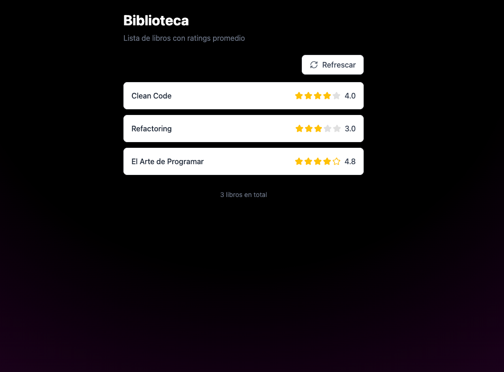

# Frontend Proyecto: Tidelit Libros (Symfony 6 + Vue 3)



### Requisitos

1. Node, npm | pnmp| bun

### Instalación

1. Clona el repositorio:
   ```bash
   git clone https://github.com/JulianLlanten8/frontend-books.git
   ```
2. Navega al directorio del proyecto:
   ```bash
   cd frontend
   ```
3. Configura las variables de entorno en el archivo `.env` o `.env.example` según tus necesidades.

   ```bash
   cp .env.example .env
   ```

4. Instala las dependencias con su gestor de paketes preferido.

   ```bash
   bun run dev
   ```

5. Accede a la aplicación en tu navegador web en http://localhost:5173/
